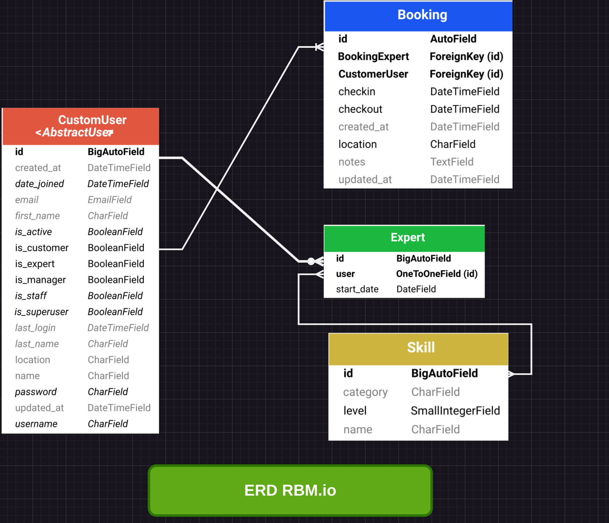
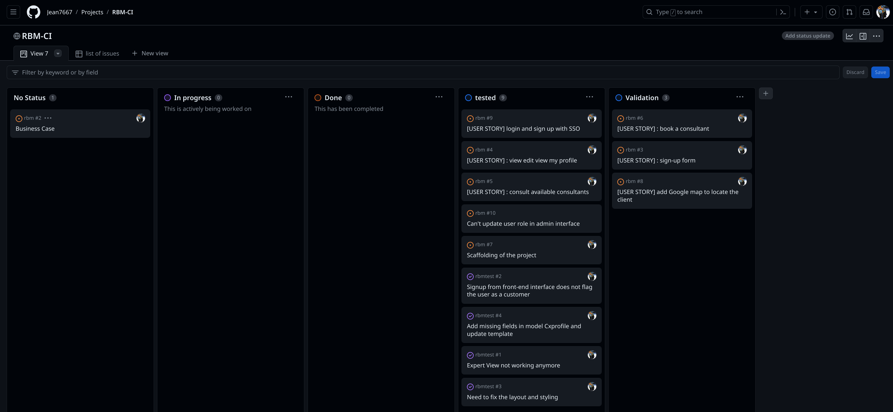

# Python compatibility

Django 5.03 and Python 3.12.4 October 2023
Upgraded heroku stack and added a new buildpack


# Tools and settings
Pyenv to manage different versions of python on the machine
Virtualenv to create Python virtual environements
Virtualwrapper to help to manage virtual environments
automation of repositories creation and and remote repositories with gh


# Link to the project 

https://rbm-app-aa6d3f2add38.herokuapp.com/
 

# Title: Business Case for Customer Booking App for Consultant Services

# Objective:
To develop an application that enables customers to easily book consultants and experts for specific project tasks, streamlining the process and enhancing customer experience.

# Problem Statement:
Currently, there is a lack of efficient and user-friendly platforms for customers to book consultants and experts for project tasks. This results in time-consuming processes and potential delays in project delivery.

# Solution:
Developing a application that allows customers to browse available consultants and experts, select the ones suitable for their project needs, and book them directly through the app. The app will notify both the customer and the chosen consultant of the booking details, including the customer's address and all necessary information for the consultant to join the customer on-site.

# Benefits:

Improved customer experience through a seamless booking process.
Enhanced efficiency by streamlining consultant selection and booking.
Increased transparency with all relevant information provided upfront.
Reduced administrative burden for both customers and consultants.
Higher customer satisfaction leading to repeat business and referrals.

# Conclusion:

By developing a customer booking app for consultant services, we aim to address the current challenges in the booking process. This initiative aligns with our goal of providing innovative solutions to meet customer needs and stay ahead of the competition in the industry.

 # How it Works


Booking Consultant: The website acts as a booking consultant, guiding clients through the process of finding the right expert for their requirements. Clients can input their needs, preferences, and desired skill sets into the platform, which then generates a curated list of experts who match those criteria.

Check the List of Experts: Once the client has specified their requirements, they can browse through the list of experts provided by the website. Each expert is accompanied by a detailed profile outlining their skills, areas of expertise.

Find the Skillset You Need: Clients can easily filter and search through the list of experts to find the specific skillset they require. 

Get the Expert Right to Your Door: After selecting the desired expert, clients can proceed to book their services directly through the website. RBM ensures a seamless experience by handling all the logistics, including scheduling and coordination, to ensure that the expert arrives at the client's location promptly.


 # Customer need and business case


### [Link to the live site](https://.herokuapp.com/)
---

## Table of contents 

 1. [ UX ](#ux)
 2. [ Agile Development ](#agile-development)
 3. [ Features implemented ](#features-implemented)  
 4. [ Features Left to Implement ](#features-left-to-implement)  
 5. [ Technology used ](#technology-used) 
 6. [ Testing ](#testing)  
 7. [ Bugs ](#known-bugs)  
 8. [ Deployment](#deployment)
 9. [ Resources ](#resources)  
 10. [ Credits and acknowledgements ](#credits-and-acknowledgements)

---

# UX

<a name="ux"></a>

I use Linux Pencil and hand drawing

## Database planning 




#### Data structure


- After deciding on the kind of the project and features I wanted to implement I used a Draw io to plan the database structure.
- The above diagram is serving as an initial guide to indicate the types and relationships between data stored.

#### Data models

CustomUser
Field Name	Field Type	Description
location	CharField	User's location
name	CharField	User's name
is_customer	BooleanField	Indicates if user is a customer
is_expert	BooleanField	Indicates if user is an expert
is_manager	BooleanField	Indicates if user is a manager
created_at	DateTimeField	Date and time of user creation
updated_at	DateTimeField	Date and time of user profile update
Skill
Field Name	Field Type	Description
name	CharField	Name of the skill
category	CharField	Category of the skill
level	SmallIntegerField	Level of proficiency in the skill
Expert
Field Name	Field Type	Description
user	OneToOneField	Link to CustomUser model
skills	ManyToManyField	Skills associated with the expert
start_date	DateField	Start date of expertise
Booking
Field Name	Field Type	Description
id	AutoField	Primary key for the booking
BookingExpert	ForeignKey	Link to CustomUser model for the expert
CustomerUser	ForeignKey	Link to CustomUser model for the customer
checkin	DateTimeField	Check-in date and time for the booking
checkout	DateTimeField	Check-out date and time for the booking
location	CharField	Location of the booking
notes	TextField	Additional notes for the booking
created_at	DateTimeField	Date and time of booking creation
updated_at	DateTimeField	Date and time of booking update


## UX design


### Overview

#### Design

> Initial design planning

Early design stage of this project included making png versions of a homepage and login page prototypes.
Thanks to that I could decide on the aesthetic choices before entering the coding stage.


#### Goals for the website

- To allow customers to browse the list of experts and their skills
- To allow customers to plan to book a consultant 
- To store the bookings data
- change the booking update the customer profile

### Wireframes

The next stage of UX design planning was creating the basic wireframes using Pencil 
Create minimalist and visual interface that is easy navigate. 


> Large to medium screens

![Home Page]


![Customer Profile]


![Welcome Page]


![Sign Up page]


![Our Experts per skills ]


![Our Experts page with booking option delete edit]


##### [ Back to Top ](#table-of-contents)

# Agile Development

In our project, we utilized GitHub for project management, harnessing its robust issue tracking system to effectively manage bugs. Adhering to Agile principles, we divided our work into multiple iterations, ensuring incremental progress and adaptability to evolving requirements. We embarked on two separate projects aimed at defining the optimal architecture and design. Through iterative development cycles, we refined our architectural decisions iteratively, prioritizing flexibility and scalability. Continuous feedback loops enabled us to gather insights, iterate on designs, and promptly address emerging challenges. By embracing Agile methodologies, we fostered collaboration and transparency among team members, facilitating smoother communication and alignment towards project goals. The iterative approach allowed us to incorporate stakeholder feedback iteratively, ensuring the final product met user expectations effectively. Through GitHub's project management features, we maintained visibility into project progress, enabling informed decision-making and timely adjustments. Our dedication to Agile practices and iterative development yielded a robust, adaptable project architecture and design that effectively met functional requirements and stakeholder expectations.





## Overview

## User Stories

> List of Mandatory User Stories

[USER STORY] : book a consultant 
[USER STORY] : sign-up form
[USER STORY] : login and sign up 
[USER STORY] : view edit view my profile
[USER STORY] : consult available consultants


You can review the project management at https://github.com/users/Jean7667/projects/6

### Navbar and Footer:

- The site is design for wide screens first but it is fully responsive.
- The site has been tested on ResponsiveStack, physical device such as Honor phone, Iphone 13 and android tablet.

A video is available on Youtube to demonstrate the responsiveness 


- Navbar and footer are present on every page
- Navbar's content changes depending on user authentication, allowing access to profile and user bookings
- Footer includes social links and address to provide the necessary informations in an easy way.

### Index page:

- The homepage provides the links to booking and about us page.
- It can be accessed without signing in.

### About Us page:

Generic about page 

The "About Us" page introduces the company or individual, establishes credibility, and builds trust by sharing the history, mission, values, and team members. It differentiates the business from competitors by highlighting unique aspects. This page fosters connection and engagement with visitors while providing essential information and navigation links.

### Authentication and profile management:

- User can sign up to create their profile 
- User can log in to their account and update their informations
- User can delete their account alltogether with all their data

I used the UserAbstrat Model for this project 

The custom user model abstract in Django offers flexibility by allowing developers to tailor user models to specific project needs. It empowers customization of user attributes and authentication methods without altering the core Django framework. This abstraction enhances scalability, enabling seamless integration of additional features and third-party packages. Moreover, it promotes better code organization by centralizing user-related logic within the project. Additionally, the custom user model abstract facilitates adherence to security best practices by providing control over authentication mechanisms and user data storage.

https://learndjango.com/tutorials/django-custom-user-model

### Bookings:

- User can pass their data to create a booking.
- User can edit their selected booking.
- Currently the initial version of booking cancellation view has not been fully implemented. I decided to implement an automatic delete_booking view, that allows User to quickly remove their booking from the system.

### Responsiveness:

- Website is responsive 💯 thanks to Bootstrap and media queries applied.
- There's a hamburger navbar on small devices.
- Website is tested on multiple device available in chrome dev tools 
- media query 992 768 320 and 540 have been added to css file.

among the device tested 

Device	Resolution	Device Pixel Ratio (DPR)	User Agent
Apple iPhone SE	375 x 667	2	iPhone
Apple iPhone XR	414 x 896	2	iPhone
Apple iPhone 12 Pro	390 x 844	3	iPhone
Apple iPhone 12 Pro Max	428 x 926	3	iPhone
Apple iPad Mini	768 x 1024	2	iPad
Apple iPad Pro	1024 x 1366	2	iPad
Samsung Galaxy S20 Ultra	412 x 915	3.5	Galaxy
Samsung Galaxy S21 Ultra	412 x 915	3.5	Galaxy
Google Pixel 4	411 x 869	2.75	Pixel
Google Pixel 5	393 x 851	2.75	Pixel
Microsoft Surface Duo	540 x 720	2	Surface
Microsoft Surface Pro 7	912 x 1368	1.5	Surface
Samsung Galaxy Fold	280 x 653 (folded)	3.5	Galaxy

Test done with chrome dev tools check the video.

https://youtu.be/A4cpX3HhbqU

##### [ Back to Top ](#table-of-contents)

---

# Features Left to Implement

- [USER STORY: BOOKING CANCELLATION]

No feature left for implaementation 

##### [ Back to Top ](#table-of-contents)

---

# Technology used 

- Html - for page structure
- CSS - for custom styling
- Python - for the backend
- Javascript - for expert view, customer profile CRUD, menu navbar
- JS Select2 Library
- Django 5.03 - framework used to build this project
- Bootstrap 5 - front end framework used by me alongside Django, helps with fast and efficient styling
- PostgreSQL - used as the database
- Google Fonts- currently only for the hero image font
- GitHub - for storing the code and for the projects Kanban
- Heroku - for hosting and deployement of this project
- Git - version control tool

##### [ Back to Top ](#table-of-contents)

---

# Testing


### Responsiveness

Optmised for large and wide screens due dynamic tables

### Manual testing

#### Account Registration Tests
| Test |Result  |
|--|--|
| User can create profile | Pass |
| User can log into profile | Pass |
| User can log out of profile | Pass |

---

#### User Navigation Tests

| Test | Result  |
|--|--|
| User can easily navigate to Bookings | Pass |
| User can access About Us page| Pass|
| User access their account page|Pass|
| User can access the card content in About Us|Pass|
| SuperUser can access admin page|Pass|
| SuperUser can create a expert add skills add a flag for customer or expert admin page|Pass|

#### Expert Booking and Profile Tests

| Test |Result  |
|--|--|
|User can make a booking | Pass |
|User can view all of their bookings | Pass |
|User can delete their booking | Pass |
|User can edit booking | Pass |
|User can make more than one booking | Pass |
|User can delete their account | Pass |
|User can edit their information | Pass |
|User can see the confirmation information | Pass |
|User can add skill from Admin interface the confirmation information | Pass |


##### [ Back to Top ](#table-of-contents)

---
 
# Known bugs 

- function cleandata not finished to implement, this function was created to set valid data in the formbooking form.
- The username of the expert is not passed in the form t book the expert 


##### [ Back to Top ](#table-of-contents)

---

# Deployment

#### The deployment stage of the website should follow the steps below:

> Create the Heroku app


- Sign up / Log in to Heroku
- In Heroku Dashboard page select 'New' and then 'Create New App'
- Name a project - I decided on the  (the app's name must be unique)
- Select EU as that was my region in the moment of creating the app
- upgrade stack to 24 
- and create a Python build pack
- Select "Create App"
- In the "Deploy" tab choose GitHub as the deployment method
- Connect your GitHub account/ find and connect your GitHub repository

Check the log

> Set up enviroment variables

- In the Django app editor create env.py in the top level
- In env.py import os
- In env.py set up necessary enviroment variables:
  - add a secret key using: os.environ['SECRET_KEY'] = 'your secret key'
  - for the database variable the line should include os.environ['DATABASE_URL']= 'Paste the database link in here'
  - in settings.py replace value of SECRET_KEY variable with os.environ.get('SECRET_KEY')
  - in settings.py change the value of DATABASES variable to 'default': dj_database_url.parse(os.environ.get("DATABASE_URL"))
- In Django app's settings.py on top of the file add:
```
from pathlib import Path
import os
import dj_database_url
if os.path.isfile('env.py'):
    import env
```
- Navigate to the "Settings" tab in Heroku.
- Open the "Config Vars" section and add DATABASE_URL as Key and the database link from app's env.py as Value
- Add SECRET_KEY for the Key value and the secret key value from env.py as the Value
- In the terminal migrate the models over to the new database connection
- In settings.py add the STATIC files settings as follows:
```
STATIC_URL = '/static/'
STATICFILES_DIRS = [os.path.join(BASE_DIR, 'static')]
STATIC_ROOT = os.path.join(BASE_DIR, "staticfiles")
```
- Change the templates directory in settings.py to: TEMPLARES_DIR = os.path.join(BASE_DIR, 'templates')
- In TEMPLATES variable change the 'DIRS' key to look like this: 'DIRS': [TEMPLARES_DIR],
- Add Heroku to the ALLOWED_HOSTS list (the format will be your-app-name.herokuapp.com, you can copy it from the Domains section in Settings tab in your Heroku app)
- If you haven't done that up to this point, then create in your Django app's code editor new top level folders: static and templates
- Create a new file on the top level directory - Procfile, remembering to use a capital letter
- Within the Procfile add following:
```
web: guincorn PROJECT_NAME.wsgi
``` 
- In the terminal, add the changed files, commit and push to GitHub

> Heroku deployment

- In Heroku, navigate to the Deployment tab and deploy the branch manually 
- Heroku will display a build log- watch the build logs for any errors
- Once the build process is completed Heroku displays 'Your App Was Successfully Deployed' message and a link to the app to visit the live site
- As my first 2 build attempts failed I needed to apply changes to my code (I forgot to set up the static files and templates) to successfully deploy on the 3rd time 

#### Forking the repository

By forking the GitHub Repository you can make a copy of the original repository to view or change without it effecting the original repository. You can do this with following steps:

- Log in to GitHub or create an account
- Enter this [repository link](https://github.com/)
- Select "Fork" from the top of the repository
- A copy of the repository should now be created in your own repository

#### Create a clone of this repository

Creating a clone enables you to make a copy of the current version of this repository to run the project locally. To do this follow steps below:

- Navigate to https://github.com/
- Click on the <>Code button at the top of the list of files
- Select the "HTTPS" option on the "Local" tab and copy the URL it provides to the clipboard
- Navigate to your code editor and in the terminal change the directory to your chosen location 
- Type "git clone" and paste the GitHub repository's link
- Press enter and git will clone the repository for you

##### [ Back to Top ](#table-of-contents)

---

# Resources

- [Code Institute Full Stack Development course materials](https://codeinstitute.net/global/full-stack-software-development-diploma/?sitelink=FullStackDiploma-IRL&utm_term=code+institute&utm_campaign=CI+-+IRL+-+Search+-+Brand&utm_source=adwords&utm_medium=ppc&hsa_acc=8983321581&hsa_cam=14304747355&hsa_grp=128775288209&hsa_ad=635725005315&hsa_src=g&hsa_tgt=kwd-319867646331&hsa_kw=code+institute&hsa_mt=e&hsa_net=adwords&hsa_ver=3&gad_source=1&gclid=Cj0KCQiAgqGrBhDtARIsAM5s0_l13h8fkiqZeHnw16zshbX6svuL8YJNrw6G-RFdq03RQybQXLSoZiYaAjGqEALw_wcB) 
- [Django documentation](https://www.djangoproject.com/)
- [Bootstrap docs](https://getbootstrap.com/docs/5.0/getting-started/introduction/)
- [Stack overflow](https://stackoverflow.com/)
- [Multiple books and Youtube Videos]
- [LearnDjango](https://learndjango.com/tutorials/django-custom-user-model)

##### [ Back to Top ](#table-of-contents)

---

# Credits and acknowledgements

##### [ Back to Top ](#table-of-contents)


